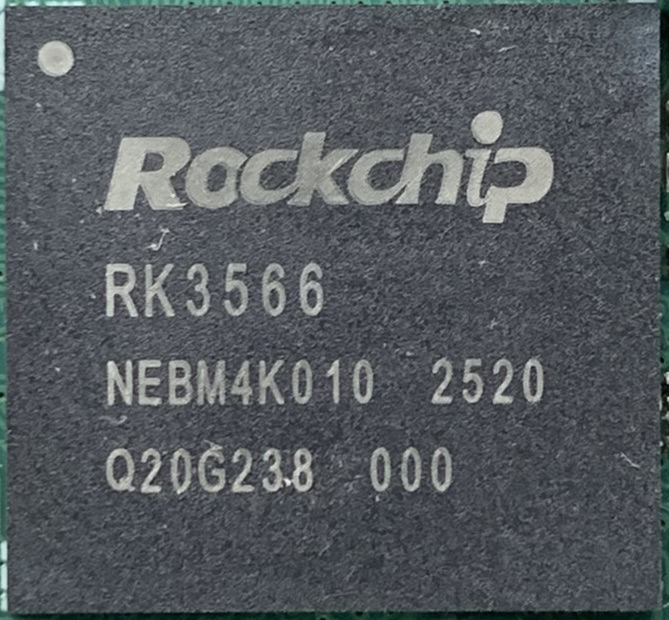
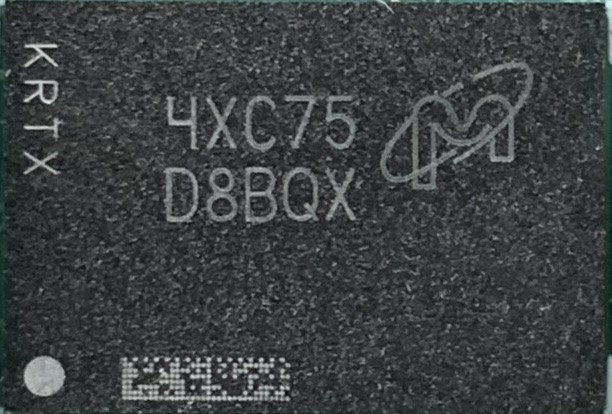
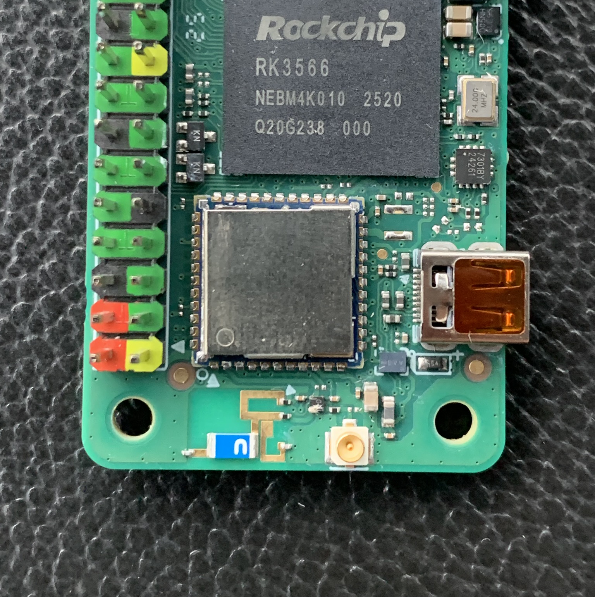
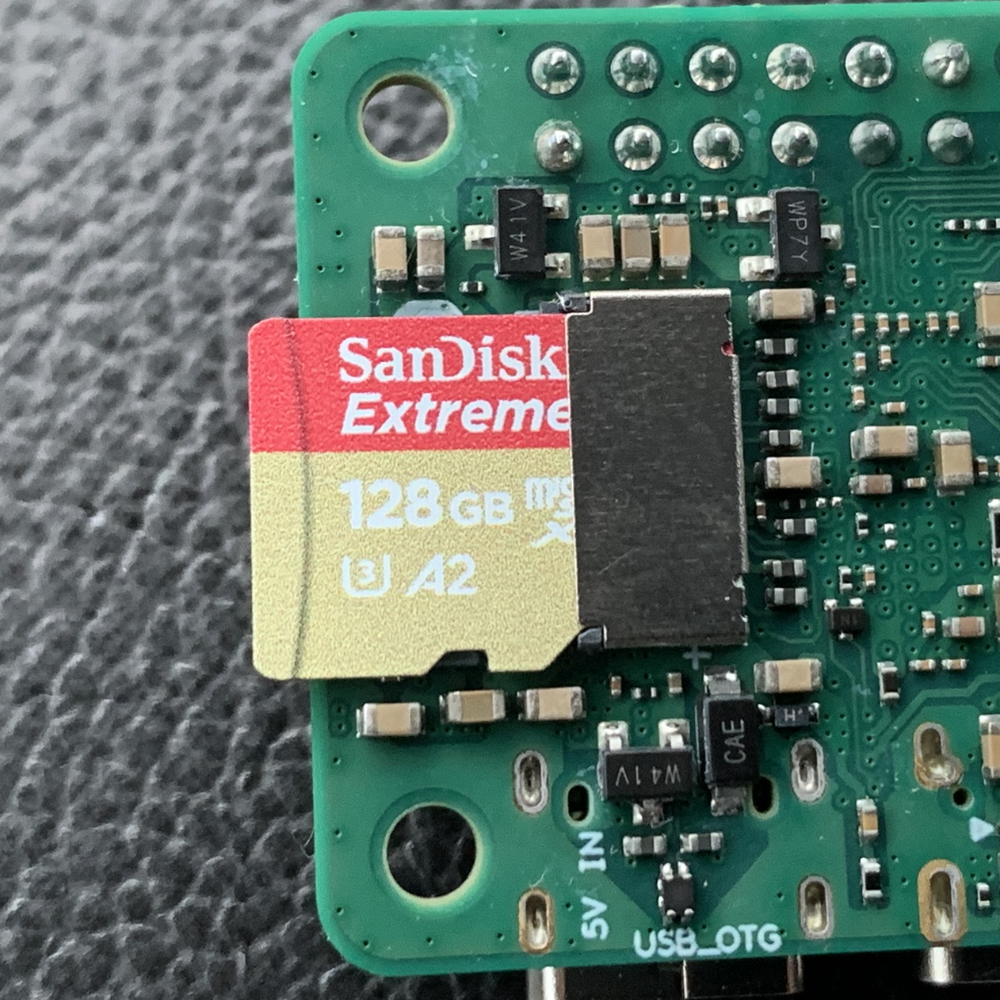
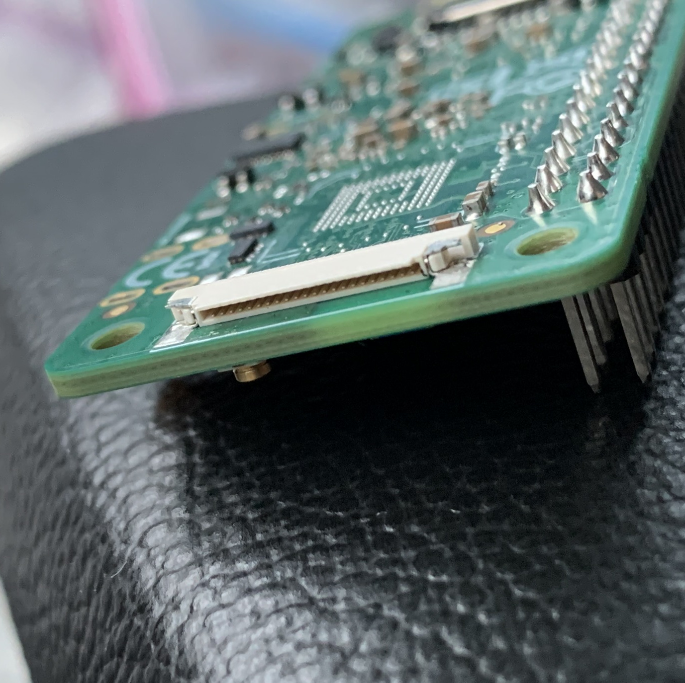

# Radxa Zero 3W

**The Best Bang-for-Buck Raspberry Pi Zero Alternative in 2025**

A credit-card-sized powerhouse that delivers desktop-class performance, AI acceleration, and modern connectivity — all in the familiar Pi Zero form factor.


---

## Why Radxa Zero 3W?

| Feature | Radxa Zero 3W | Raspberry Pi Zero 2W |
|:--------|:-------------:|:--------------------:|
| **CPU** | Quad-core Cortex-A55 @ 1.6GHz | Quad-core Cortex-A53 @ 1.0GHz |
| **RAM** | 1GB / 2GB / 4GB / 8GB LPDDR4 | 512MB LPDDR2 |
| **USB** | USB 3.0 (5Gbps) + USB 2.0 OTG | USB 2.0 only |
| **WiFi** | WiFi 6 (802.11ax) + BT 5.4 | WiFi 4 (802.11n) + BT 4.2 |
| **NPU** | 0.8 TOPS (Edge AI) | ❌ None |
| **GPU** | Mali-G52-2EE (Vulkan 1.1) | VideoCore IV |
| **eMMC** | Up to 64GB onboard (5.1) | ❌ None |

> **Bottom Line:** Up to 16× the RAM, true USB 3.0, WiFi 6, and an integrated NPU — for roughly the same price point.

---

## Technical Specifications

### SoC: Rockchip RK3566

| | |
|:---:|:---:|
|  |  |
| **Quad-core ARM Cortex-A55 @ 1.6GHz** | **LPDDR4 RAM (up to 8GB)** |

- **CPU:** 15–20% more power-efficient than Cortex-A53 cores at equivalent performance
- **NPU:** Integrated 0.8 TOPS Neural Processing Unit for Edge AI tasks (object detection, voice processing, ML inference)
- **GPU:** Mali-G52-2EE with Vulkan 1.1, OpenGL ES 3.2, and OpenCL 2.0 support
- **Video Decode:** 4K@60fps H.265/H.264/VP9 hardware decoding
- **RAM:** LPDDR4 provides significantly higher bandwidth for shared CPU/GPU memory operations

| | |
|:---:|:---:|
|  |  |
| **eMMC 5.1 Storage** | **WiFi 6 + BT 5.4 Module** |

> **Note:** No eMMC on my board — using microSD instead.

---

## Connectors & Interfaces

| USB 3.0 / 2.0 | SD Card Slot | CSI Camera |
|:-------------:|:------------:|:----------:|
|  |  |  |

### USB

- **USB Type-C (Top):** TRUE USB 3.0 Host @ 5Gbps — rare for this form factor!
- **USB Type-C (Bottom):** USB 2.0 OTG for power and data

### 40-Pin GPIO Header

<p align="center">
  
</p>

Full Raspberry Pi-compatible pinout with expanded capabilities:

| Interface | Pins Available |
|-----------|----------------|
| **UART** | 2× (debug + general purpose) |
| **SPI** | 2× buses |
| **I2C** | 2× buses |
| **PWM** | 4× channels |
| **ADC** | 1× channel (SARADC) |
| **GPIO** | 28× general-purpose pins |

### Storage Options

| Type | Speed | Notes |
|------|-------|-------|
| **eMMC 5.1** | Up to 250 MB/s sequential | Soldered onboard (optional) |
| **microSD** | UHS-I (up to 104 MB/s) | Hot-swappable |

### Wireless Connectivity

- **WiFi 6 (802.11ax):** 2.4GHz/5GHz dual-band, up to 600Mbps
- **Bluetooth 5.4:** BLE, enhanced range and throughput
- **Antenna:** Software-switchable between onboard antenna and external u.FL connector

### Camera

- **CSI:** 2-lane MIPI CSI-2 connector for camera modules

---

## Pro Tips: Getting Started

### Recommended OS

| OS | Best For |
|----|----------|
| **[Armbian](https://www.armbian.com/)** | Headless servers, Docker, development |
| **[Radxa OS](https://github.com/radxa/debos-radxa)** | Desktop usage, official driver support |

### Thermal Management

> ⚠️ **Heatsink Recommended:** The RK3566 can sustain 1.6GHz under load, but will throttle without passive cooling. A small aluminum heatsink (included with some kits) is strongly recommended for:
> - Sustained AI/NPU workloads
> - 4K video decoding
> - Heavy I/O operations (USB 3.0 transfers)

### Quick Start (TODO upload image link)

```bash
# Flash image to SD card (Linux/macOS)
sudo dd if=radxa-zero-3w.img of=/dev/sdX bs=4M status=progress

# First boot: expand filesystem and update
sudo apt update && sudo apt upgrade -y
```

---

## Resources

- [Radxa Wiki](https://wiki.radxa.com/Zero3)
- [Schematic & Pinout](https://wiki.radxa.com/Zero3/hardware)
- [Radxa Community Forum](https://forum.radxa.com/)

---

<p align="center">
  <em>Built for makers, developers, and edge computing enthusiasts.</em>
</p>


