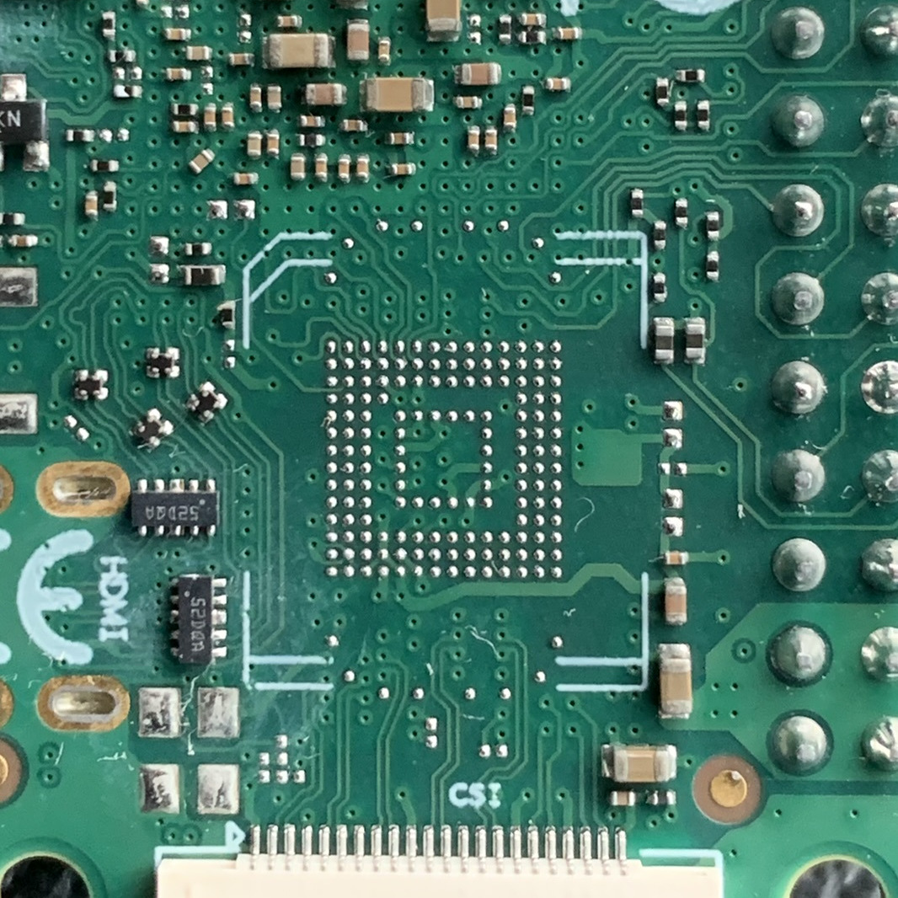
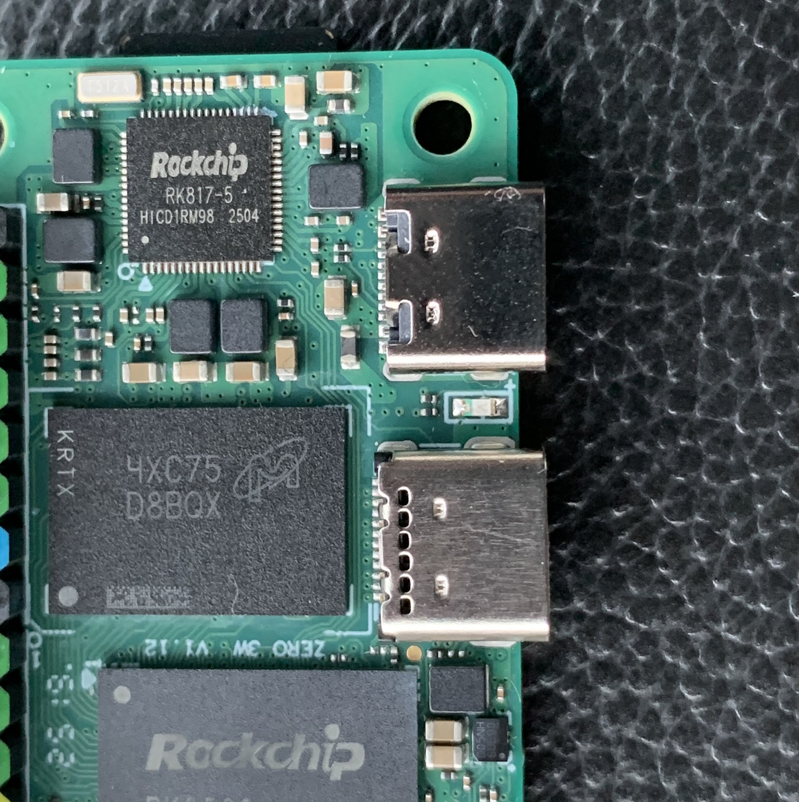
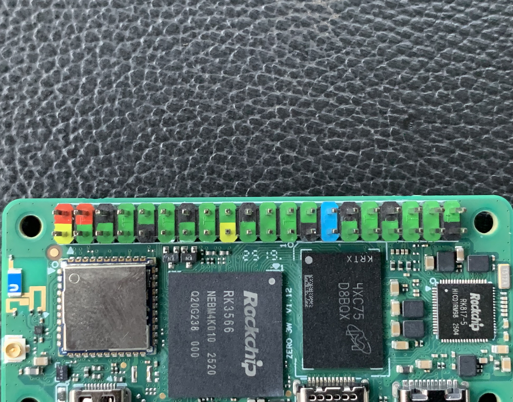

# Raxda Zero 3w

The best bang/buck RPI zero-shaped SBC in 2025.

## Key Components

| RK3566 CPU | LPDDR4 RAM | eMMC Storage | WiFi Module |
|:----------:|:----------:|:------------:|:-----------:|
|  |  |  |  |

> **Note:** No eMMC on my board :(

## Connectors & Interfaces

| USB | GPIO Header | SD Card Slot |
|:---:|:-----------:|:------------:|
|  |  |  |

